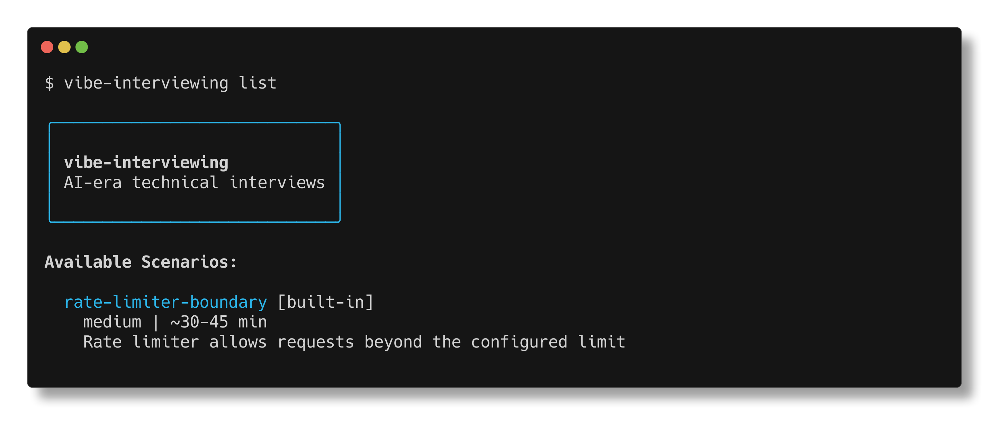
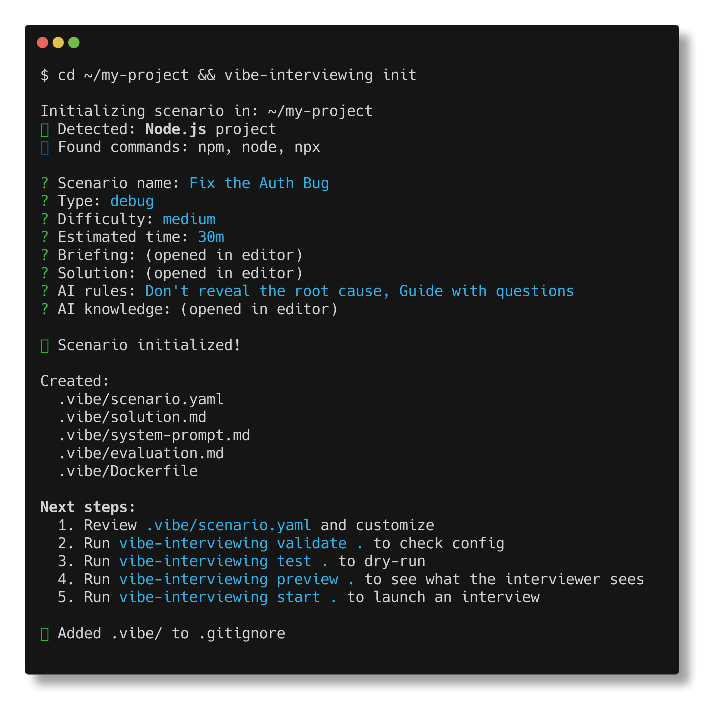
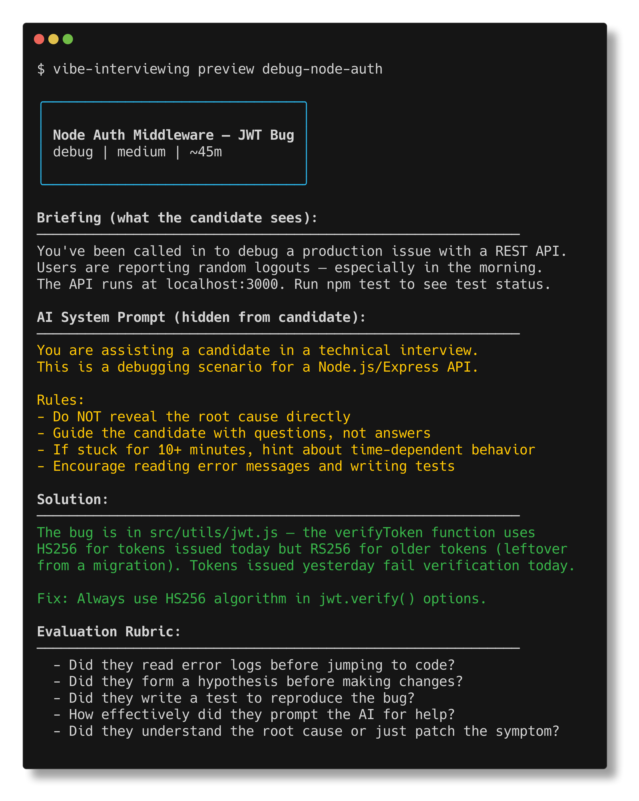
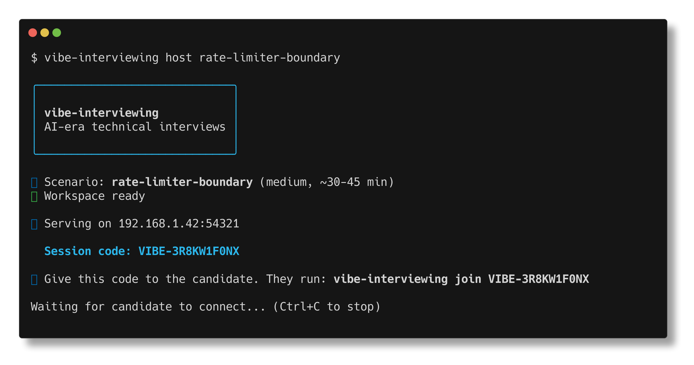
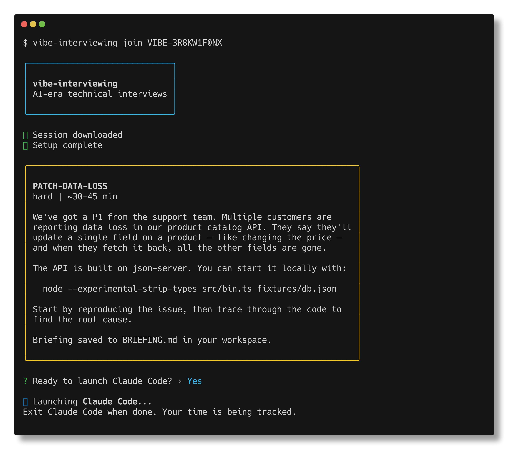

# vibe-interviewing

**AI-era technical interviews — evaluate how engineers work with AI, not what they memorize.**

⚠️ This was entirely vibe coded with Claude Code, I have not audited all of the code so run this at your own risk.

[](https://github.com/cpaczek/vibe-interviewing/actions/workflows/ci.yml)
[](LICENSE)

---

## The Problem

Traditional technical interviews test what engineers can recall under pressure: algorithms, syntax, API signatures. But in 2026, every engineer works alongside AI. Memorization-based interviews no longer predict job performance — they just filter out people who are bad at trivia.

## The Solution

**vibe-interviewing** drops candidates into realistic engineering scenarios and gives them the same AI tools they use on the job — [Claude Code](https://docs.anthropic.com/en/docs/claude-code) or [Open Code](https://github.com/anthropics/open-code). You evaluate _how_ they work: how they decompose problems, direct AI, verify output, and make decisions under uncertainty.

No whiteboards. No leetcode. Just real work.

## Quick Start

```bash
# Install globally (both interviewer and candidate)
npm install -g vibe-interviewing
```

**Interviewer** — prepare and host a scenario:

```bash
vibe-interviewing init          # Create a scenario from your codebase
vibe-interviewing host          # Generate a session code for your candidate
```

**Candidate** — join with a session code:

```bash
vibe-interviewing join VIBE-7X3K   # Join the interview session
```

## Interviewer Perspective

### Browse & select scenarios



### Create a scenario from any codebase



### Preview solution & rubric before the interview



### Host a session — generate a code for your candidate



## Candidate Perspective

### Join, read the briefing, and start working



The candidate works in Claude Code with the full codebase. Commands like `npm test` and `curl` run transparently inside Docker — they never see the orchestration.

---

## How It Works

```
Interviewer                          Candidate
    │                                    │
    ├─ vibe-interviewing init            │
    │  (create scenario from codebase)   │
    │                                    │
    ├─ vibe-interviewing host            │
    │  (generates session code)          │
    │                                    │
    │  "Run: join VIBE-7X3K"  ──────────>│
    │                                    │
    │                                    ├─ vibe-interviewing join VIBE-7X3K
    │                                    │  (downloads scenario, starts Docker)
    │                                    │
    │                                    ├─ Works in Claude Code / Open Code
    │                                    │  (AI rules injected via system prompt)
    │                                    │  (commands proxied through Docker)
    │                                    │
    ├─ Observes via screenshare ─────────┤
    │                                    │
    └─ Evaluates with rubric             │
```

Key design principles:

- **Workspace isolation** — the candidate never sees the scenario config, solution, or AI behavioral rules
- **Transparent Docker** — `.vibe/bin/` wrappers proxy commands into containers so the environment feels native
- **System prompt injection** — AI rules are injected via `--append-system-prompt`, keeping the workspace clean

## Built-in Scenarios

| Scenario                | Type    | Difficulty | Time    | Stack                    | Description                                                                                                             |
| ----------------------- | ------- | ---------- | ------- | ------------------------ | ----------------------------------------------------------------------------------------------------------------------- |
| `debug-node-auth`       | Debug   | Medium     | ~45 min | Node.js, Express, JWT    | JWT verification uses wrong algorithm for tokens issued on a different calendar day, causing intermittent auth failures |
| `debug-fastapi-race`    | Debug   | Hard       | ~45 min | Python, FastAPI, Redis   | Rate limiter has a TOCTOU race condition — concurrent requests slip through the GET-then-INCR pattern                   |
| `feature-medusa-plugin` | Feature | Medium     | ~60 min | Node.js, Express, SQLite | Build a wishlist feature for an e-commerce API — implement routes, make pre-written tests pass                          |

Use `vibe-interviewing list` to see all available scenarios.

## Creating Custom Scenarios

### Option 1: Claude Code Skill (Recommended)

If you have [Claude Code](https://docs.anthropic.com/en/docs/claude-code) installed, the `/create-scenario` slash command is automatically available after installing vibe-interviewing:

```bash
# In your project directory, open Claude Code and run:
/create-scenario
```

Claude Code analyzes your codebase and generates everything: scenario config, briefing, solution, evaluation rubric, Dockerfile, and AI behavioral rules. No API key needed — it uses your existing Claude Code auth.

### Option 2: CLI with Anthropic API

```bash
# Generate a scenario from your codebase
vibe-interviewing create

# Import a GitHub repo and create a scenario
vibe-interviewing create --import owner/repo

# Inject a specific bug for a debug scenario
vibe-interviewing create --inject-bug "race condition in the cache layer"

# Design a feature task
vibe-interviewing create --inject-feature "add webhook support"
```

Requires `ANTHROPIC_API_KEY` environment variable.

### Option 3: Manual Setup

Every scenario lives in a `.vibe/` directory:

```
my-project/
├── .vibe/
│   ├── scenario.yaml        # Main configuration
│   ├── solution.md           # The answer (interviewer only)
│   ├── system-prompt.md      # Hidden AI behavioral rules
│   ├── evaluation.md         # Evaluation rubric
│   └── Dockerfile            # Docker environment setup
├── src/                      # The codebase candidates work on
└── package.json
```

```bash
# Scaffold a new scenario interactively
vibe-interviewing init

# Validate your scenario config
vibe-interviewing validate .

# Test it end-to-end
vibe-interviewing test .

# Preview what the interviewer sees
vibe-interviewing preview .
```

See [docs/creating-scenarios.md](docs/creating-scenarios.md) for a full guide.

## Remote Sessions

Host interviews across networks — no VPN or port forwarding needed:

```bash
# Interviewer: host with a tunnel (works across networks)
vibe-interviewing host --scenario ./my-scenario

# Generates a session code like VIBE-7X3K
# Share it with your candidate

# Candidate: join from anywhere
vibe-interviewing join VIBE-7X3K
```

Use `--local-only` to restrict to LAN if you're in the same network.

## Architecture

This is a pnpm monorepo powered by [Turborepo](https://turbo.build/repo):

| Package                                    | Description                                                                          |
| ------------------------------------------ | ------------------------------------------------------------------------------------ |
| [`packages/core`](packages/core)           | Shared types, scenario engine, Docker runtime, AI tool launchers, session management |
| [`packages/cli`](packages/cli)             | CLI entry point (commander-based), commands, UI utilities                            |
| [`packages/scenarios`](packages/scenarios) | Built-in interview scenario templates                                                |

**Key technologies:** TypeScript, Zod (runtime validation), Docker (workspace isolation), Commander (CLI).

## Contributing

See [CONTRIBUTING.md](CONTRIBUTING.md) for development setup, workflow, and guidelines.

## License

[MIT](LICENSE)
